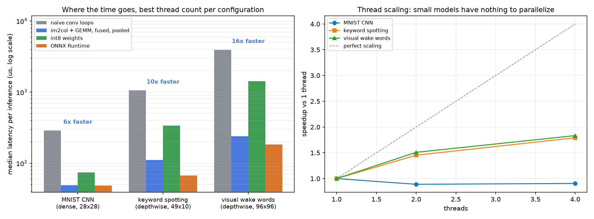

# nanoinfer

A neural-network inference engine written from scratch in C++: own tensors, own
convolution kernels, own memory planner, own int8 quantization. No runtime
dependencies beyond a BLAS `sgemm` and a thread library.

It targets edge-sized CNNs — the kind that run on a phone or a
microcontroller-class budget — and it is fast enough to be measured honestly
against ONNX Runtime rather than against a strawman.



## Where it lands

Apple M4 Pro, single inference, median of 600 timed runs at the best thread
count for each configuration. Same weights and same inputs through both engines,
verified numerically identical first.

| model | naive conv | this engine | ONNX Runtime | ladder speedup | vs ORT |
|---|---|---|---|---|---|
| MNIST CNN (dense, 28x28) | 287 us | **49 us** | 48 us | 5.9x | 0.99x |
| keyword spotting (depthwise, 49x10) | 1054 us | **110 us** | 67 us | 9.5x | 0.60x |
| visual wake words (depthwise, 96x96) | 3929 us | **240 us** | 184 us | 16.4x | 0.77x |

Level with the state of the art on the dense model, 1.3–1.7x behind it on the
depthwise ones. ONNX Runtime is years of hand-tuned kernels from a team; the
interesting part is not the gap, it is knowing exactly what is on the other side
of it (see [what is still slow](#what-is-still-slow)).

## What the speedup is made of

The engine keeps its naive reference kernels compiled in and selectable, so the
before/after is a real measurement rather than a memory of one. Median latency:

| configuration | MNIST | KWS | VWW |
|---|---|---|---|
| naive nested-loop convolution, 1 thread | 912 us | 3522 us | 13974 us |
| naive, best thread count | 287 us | 1054 us | 3929 us |
| im2col + `sgemm` + fusion + arena, 1 thread | **49 us** | 198 us | 440 us |
| the same, best thread count | 49 us | **110 us** | **240 us** |

The kernel work is worth 6–18x; threads add another 1.8x on the two larger
models and nothing at all on MNIST. The individual optimizations below the
kernel switch (fusion, weight pre-transposing, the 1x1 special case, the arena)
are not separately toggleable, so I am not going to attribute a number to each
one — they are inside the 49/198/440 column together.

Two of them are worth calling out because they were not obvious:

**Pre-transposing Linear weights.** `linear` needs `w` as `[K, N]` but stores it
as `[N, K]`. Transposing inside the call costs an O(K·N) copy *per inference* —
on MNIST that is 100k floats moved to do a 100k-MAC matmul. Hoisting it to load
time is free at runtime.

**1x1 convolutions are already a GEMM.** The patch matrix im2col would build for
a 1x1 stride-1 unpadded convolution is bit-for-bit the input tensor. Detecting
that and passing the input straight to `sgemm` removes a full copy of the
activations, and pointwise convolutions are half the layers in a
depthwise-separable network.

## Three bugs that produced plausible wrong answers

Each of these passed every test I had at the time, which is the point.

**The memory planner aliased a node's input with its own output.** Liveness
analysis frees a buffer after its last read. My reuse check accepted a buffer
whose last read was *the current node*, so a node could be handed its own input
as its output. Elementwise ops do not care. A GEMM reads its input while writing
its output, so two chained `Linear` layers silently corrupted each other —
6.5e-7 error on a single layer, 3.5e-2 on two. Fixed by requiring the buffer to
have been released strictly before the current node, and the plan now
[asserts the invariant](src/graph.cpp) at load time for every non-in-place op.

**Asymmetric padding collapsed to one axis.** The exporter wrote a single `pad`
and `stride` attribute. The keyword-spotting stem is a 10x4 kernel with padding
(5, 1), so the width axis got the height's padding. Output shapes still matched,
because those came from PyTorch — only the values were wrong. Now both axes are
written separately, and the conv equivalence test carries that exact
configuration as a case.

**Pooling read int8 tensors through a `float*`.** `maxpool2d` and
`avgpool_global` were written before quantization existed and unconditionally
called `.f32()`. In a quantized graph they reinterpreted int8 bytes as floats,
which read like a quantization accuracy problem rather than a type error — every
int8 model was wrong (max error 2.3e-1 on MNIST). Fixing it improved int8
accuracy by 40–145x. The graph now
[validates op/dtype combinations](src/graph.cpp) at load, so an unsupported pair
is a named load failure instead of quiet garbage.

The lesson I would carry forward: for a numerical library, "the output looks
plausible" is not evidence of anything. Every fast path is tested against a
reference implementation that is too slow to ship and too simple to be wrong,
and the invariants that are easy to violate are asserted in code rather than
trusted.

## Correctness

`tools/parity.py` runs five random inputs per model through both PyTorch and the
engine and compares.

| model | max abs difference | top-1 agreement |
|---|---|---|
| MNIST CNN | 5.2e-07 | 5/5 |
| keyword spotting | 4.7e-07 | 5/5 |
| visual wake words | 4.9e-07 | 5/5 |
| MNIST CNN, int8 | 6.0e-03 | 4/5 |
| keyword spotting, int8 | 1.4e-03 | 5/5 |
| visual wake words, int8 | 1.0e-03 | 5/5 |

Float agreement is at the level of GEMM accumulation-order noise. int8 changes
the arithmetic, so it is held to prediction agreement instead.

The unit tests (25 checks, no dependencies, no network) check the fast paths
against reference implementations: im2col GEMM vs naive convolution across six
shape configurations including grouped and non-square, the NEON depthwise path
vs naive grouped convolution, fused vs separate ReLU, and single- vs
multi-threaded output equality.

## Memory planning

Activations are carved out of one arena, with offsets assigned by liveness so
buffers get recycled. There are no allocations in the forward pass after load.

| model | arena | sum of activations | saved | buffers reused |
|---|---|---|---|---|
| MNIST CNN | 64 KB | 101 KB | 37% | 5 |
| keyword spotting | 64 KB | 284 KB | 77% | 10 |
| visual wake words | 684 KB | 1441 KB | 53% | 11 |

## int8: smaller, not faster

Post-training quantization with symmetric per-output-channel weight scales and
calibrated activation ranges. Weights shrink about 4x:

| model | f32 weights | int8 weights | f32 latency | int8 latency |
|---|---|---|---|---|
| MNIST CNN | 414 KB | 105 KB | 49 us | 74 us |
| keyword spotting | 90 KB | 28 KB | 110 us | 337 us |
| visual wake words | 140 KB | 42 KB | 240 us | 1426 us |

int8 is *slower* here, and that is not a bug — it is what the hardware says. The
float path calls Accelerate's `sgemm`, which on Apple Silicon reaches the AMX
matrix coprocessor. The int8 path is my own SDOT kernel (`vdotq_s32`, 16
multiply-accumulates per instruction), which is a good scalar-to-vector win —
early versions were 4–7x slower still, before the depthwise fast path and the
padded-stride packing — but it is a hand-written loop competing against
dedicated matrix silicon. On a target without an AMX-class unit, or where model
size is the binding constraint, the tradeoff flips. Quantization here buys 4x
smaller weights, and I would ship it for that reason, not for latency.

## What is still slow

Being specific about the remaining gap to ONNX Runtime, in the order I would
attack it:

- **Depthwise convolution is the whole gap.** The dense model is at parity; both
  models where I lose are dominated by depthwise layers. My depthwise kernel
  vectorizes across the width axis with a scalar fallback near borders, and
  processes one channel at a time. ORT blocks over channels and keeps several
  rows of accumulators live.
- **No cache blocking in the epilogue.** The bias+ReLU pass walks the whole
  output tensor again after the GEMM writes it. For layers where the output does
  not fit in L1 that is a second trip through memory; it should be tiled into the
  GEMM's N loop.
- **Thread scaling stops at about 1.8x on four cores** (right-hand chart), and
  MNIST is fastest single-threaded. Parallelism is per-op over output channels,
  so each op pays a barrier and small ops have too few channels to divide. Real
  runtimes parallelize over a fused region, not one kernel.
- **No layout choice.** Everything is NCHW because that is what the exporter
  emits. Depthwise kernels generally prefer NHWC, where the channel axis is
  contiguous and a single vector load covers 16 channels of one pixel.

Measurement caveat: run-to-run variation on an unpinned laptop is roughly ±10%,
and the ORT numbers moved by that much across runs. Differences below about 15%
in the tables above should be read as a tie.

## Building and running

Needs CMake, a C++20 compiler, and [uv](https://docs.astral.sh/uv/) for the
Python tooling.

```bash
cmake -S . -B build -DCMAKE_BUILD_TYPE=Release && cmake --build build -j
./build/ni_test                        # unit tests, no dependencies

uv sync
uv run python -m tools.parity --quantized    # engine vs PyTorch, all models
uv run python -m tools.benchmark             # ladder + ONNX Runtime comparison
uv run python -m tools.plots                 # figures
```

```
include/nanoinfer/   tensor, ops, graph, thread pool headers
src/
  tensor.cpp         tensor views and the arena allocator
  ops.cpp            conv (naive / im2col+GEMM / depthwise NEON), gemm, int8 SDOT,
                     pooling, linear, activations
  graph.cpp          model loading, liveness-based memory planning, load-time
                     invariant checks, the execution loop
  pool.cpp           persistent worker pool
tools/
  models.py          the three benchmark models
  export.py          PyTorch -> .ngm, with BatchNorm folded at export time
  parity.py          engine vs PyTorch
  benchmark.py       ladder + ONNX Runtime, same protocol for both
  plots.py           figures
tests/test_main.cpp  fast paths vs reference implementations
```

The model format is deliberately boring: a text header describing tensors and
nodes, then one binary blob of weights. It is readable with `head`, diffable, and
needs no parser library on either side.

## References

- Chellapilla et al., [High Performance Convolutional Neural Networks for
  Document Processing](https://inria.hal.science/inria-00112631/document) — im2col
- Jacob et al., [Quantization and Training of Neural Networks for Efficient
  Integer-Arithmetic-Only Inference](https://arxiv.org/abs/1712.05877)
- Zhang et al., [Hello Edge: Keyword Spotting on Microcontrollers](https://arxiv.org/abs/1711.07128) — the DS-CNN model
- Chowdhery et al., [Visual Wake Words Dataset](https://arxiv.org/abs/1906.05721)
- [MLPerf Tiny](https://github.com/mlcommons/tiny) for the benchmark model choices
